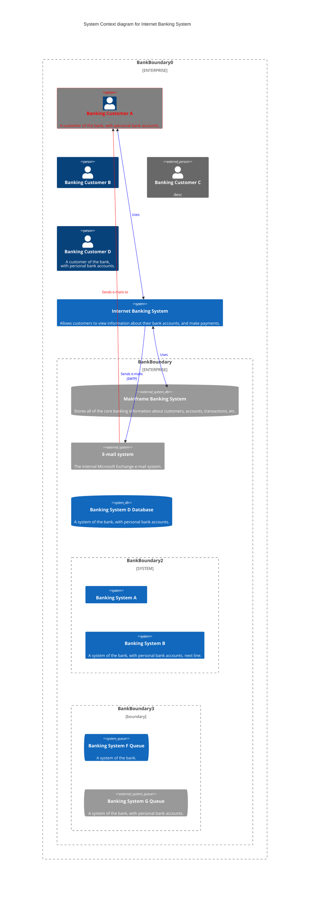

# Control Name: Secure Key Storage
Control ID: KMS-01
Category: Cryptographic Protections
Framework Alignment: NIST SP 800-53 Rev. 5: SC-12, SC-28, SC-28(1), SC-34
Control Type: Technical
Control Class: Preventive

## Control Definition:
The organization shall implement secure, centralized key storage to protect cryptographic keys used for data encryption, authentication, or digital signing. Key storage must be isolated from application code and data, enforce strict access controls, and provide capabilities for key rotation, versioning, and revocation. All cryptographic keys must be stored using a FIPS 140-2 or higher validated hardware security module (HSM) or equivalent cloud-native Key Management Service (KMS).

## Control Objectives:
- Prevent unauthorized access, disclosure, or tampering of cryptographic keys.
- Ensure the confidentiality, integrity, and availability of cryptographic materials.
- Enable secure key lifecycle management (generation, use, rotation, deactivation, destruction).
- Enforce least privilege and role-based access to key materials.
- Provide auditability and visibility into key usage.

## Implementation Requirements:
1. Key Management System (KMS):
    - Use a cloud-native or enterprise KMS (e.g., AWS KMS, Azure Key Vault, Google Cloud KMS) that supports customer-managed keys (CMKs).
    - Keys must be logically separated per application and data classification requirements.
2. Access Control:
    - Implement fine-grained access policies (e.g., IAM roles, ACLs) for key usage.
    - Require MFA for privileged access to key management interfaces.
3. Logging & Monitoring:
    - Enable detailed logging of key usage, access attempts, and administrative changes.
    - Integrate logs with SIEM for real-time monitoring and anomaly detection.

## Evidence of Compliance:
- Configuration and architecture diagrams showing use of secure KMS.
- IAM policy definitions restricting key access.
- Key rotation schedules and logs.
- Audit logs demonstrating key use and access.
- FIPS 140-2 validation certificates (or CSP compliance attestations).

